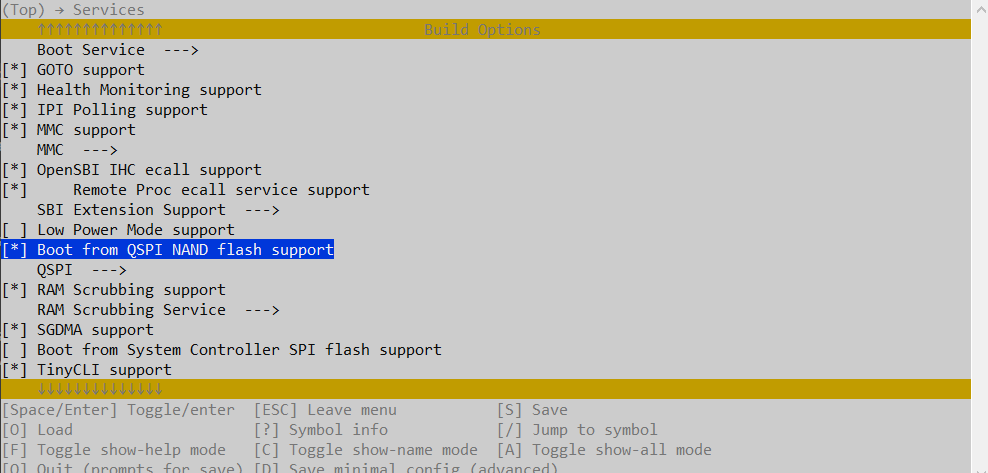

# Little Wing

## This project demonstrates how to boot the Icicle Kit from NAND Flash

The Icicle Kit does not provide (on-board) NAND Flash by default and therefore requires additional hardware, shown here:


`Little Wing` is an extension board-set, composed of two separate units:

1. MIKROE (interface board) [PI 3 Click Shield](https://www.mikroe.com/pi-3-click-shield)
2. MIKROE [FLASH 5 Click: (1G-bit) Serial SLC NAND Flash Memory from Winbond](https://www.mikroe.com/flash-5-click)

> Note: These two boards are purchased separtely from the Icicle Kit.

### Table of contents

---

<!--ts-->
* [Requirements](#requirements)
* [Setup](#setup)
* [Build Yocto Image](#build-yocto-image)
* [Build HSS - First Pass](#build-hss---first-pass)
* [Build HSS - Second Pass](#build-hss---second-pass)
* [Program QSPI](#program-qspi)

<!--te-->

## Requirements

---

### Hardware

* [Polarfire SoC Icicle Kit](https://www.microchip.com/en-us/development-tool/mpfs-icicle-kit-es)
* [PI 3 Click Shield](https://www.mikroe.com/pi-3-click-shield)
* [FLASH 5 Click: (1G-bit) Serial SLC NAND Flash Memory from Winbond](https://www.mikroe.com/flash-5-click)
* x3 micro-USB Cables
* Window Host Computer
* Linux Host Computer

This project was tested using using:

* Windows 10 host (Libero and Softconsole)
* Linux Host `Ubuntu 22.04.3 LTS` (Yocto)

### Software Applications

* [Libero SoC Design Suite](https://www.microchip.com/en-us/products/fpgas-and-plds/fpga-and-soc-design-tools/fpga/libero-software-later-versions)

* [SoftConsole V2022.2 or later](https://www.microchip.com/en-us/products/fpgas-and-plds/fpga-and-soc-design-tools/soc-fpga/softconsole)

### Software

* [Hart Software Services [HSS] (GitHub)](https://github.com/polarfire-soc/hart-software-services)

* [Meta-Polarfire-SOC-Yocto-BSP (GitHub)](
https://github.com/polarfire-soc/meta-polarfire-soc-yocto-bsp)

* [Icicle Kit Reference Design (GitHub)](
https://github.com/polarfire-soc/icicle-kit-reference-design)

## Setup

Connect up the hardware as shown.
> Icicle-Kit Power == `OFF`


## Build Yocto Image

Depending on your Linux-Host PC, this step can take anywhere from 1 to 4 hours to complete.

* Building Yocto Linux for NAND flash

Follow the steps found here for Meta-Polarfire-SOC-Yocto-BSP (GitHub): <https://github.com/polarfire-soc/meta-polarfire-soc-yocto-bsp>

Basic summary of steps on a Linux Host.
Note: This was tested using: `Ubuntu 22.04.3 LTS`

```bash
mkdir yocto-dev && cd yocto-dev
repo init -u https://github.com/polarfire-soc/polarfire-soc-yocto-manifests.git -b main -m default.xml
repo sync
repo rebase
source ./meta-polarfire-soc-yocto-bsp/polarfire-soc_yocto_setup.sh
MACHINE=icicle-kit-es-nand bitbake core-image-minimal-mtdutils
```

The output folder can be found here:

> `../build/tmp-glibc/deploy/images/icicle-kit-es-nand/`

In this folder, the required file to be used in step `n` is:

> `core-image-minimal-mtdutils-icicle-kit-es-nand.nand.mtdimg`

## Build HSS - First Pass

* Windows 10 Host
* SoftConsole v2022.2+

HSS is the first stage bootloader for the PolarFire SOC.  It was tested using SoftConsole V2022.2 on a Windows 10 Host PC.  Familiarity with Softconsole is assumed.

* Download HSS: <https://github.com/polarfire-soc/hart-software-services>
* Create an empty directory: `sc_littleWing`
* Open SoftConsole and use this new directory (`sc_littleWing`)
  * Dialog box: Do you want to create a new workspace? [OK]

* (SoftConsole Menu) File->Import
  * Existing Projects into Workspace (Next).
  * Select root directory: ..\hart-software-services-master  
  * [x] search for nested projects
  * [x] Copy projects into workspace
  * Finish

* Sanity check: `Build Project`  Takes ~ 3-to-5 minutes

> Build Finished. 0 errors, 0 warnings

* Open in Editor: ..\sc_littleWing\hart-software-services\envm-wrapper\\`Makefile`
* Change line #90 (removing the argument `--dryrun`)

```text
FROM: $(call common-boot-mode-programmer,--dryrun,`basename $@`)
  TO: $(call common-boot-mode-programmer,`basename $@`)
```

* (SoftConsole Menu) Project -> Properties ->

```text
  softconsole -> 
  Properties  -> 
  c/c++ build->behavior-> 
     [x] clean 'distclean'
     [Apply and Close]
```

Now the project will use `distclean` instead of 'clean' (avoid clean & build errors)

* *RUN* Clean Project (Build Finished. 0 errors, 0 warnings.)

Connect the Icicle Kit, J33 and J11, USB to the Host Computer.

* Power Switch == `Off`
* Open x2 Serial port terminals (TeraTerm), 115K/n/8/1, on the Host Computer

```text
1. Silicon Labs Quad CP2108 USB to UART Bridge Interface 0
2. Silicon Labs Quad CP2108 USB to UART Bridge Interface 1
```

* Power Switch == `On`

* (SoftConsole) "Build Project"

> Note: In this step, eNVM is automatically programmed with the first stage bootloader, HSS.

OUTPUT WINDOW in SoftConsole shows ...

```text
:
 INFO  - Generating BIN file...
 INFO  - Generating header...
 INFO  - Generating HEX file...
 INFO  - Preparing for bitstream generation...
 INFO  - Generating bitstream...
 INFO  - Programming the target...
 INFO  - mpfsBootmodeProgrammer completed successfully.
   text    data    bss     dec     hex filename
  99812    416     149632  249860  3d004 Default/hss-envm-wrapper.elf

 Build Finished. 0 errors, 0 warnings. (took 1m:15s.743ms)
```

> The Icicle Kit initial preparation is complete

## Build HSS - Second pass

* Windows 10 Host using WSL `OR` Linux Host

The existing HSS project needs to be modified to allow booting from NAND flash (this is not enabled by default). This can't be accomplished using SoftConsole and needs to be done using Linux or WSL.

Example using WSL (on Windows):

* In a WSL window, Navigate to project `/sc_littleWing/hart-software-services`, at the command prompt `$`, type :

```bash
  make BOARD=mpfs-icicle-kit-es config
```

This opens a text based GUI program.  Make this change to enable booting from QSPI.

```text
services->
   [*] Boot from QSPI NAND flash support
-> QSPI -> QSPI Driver (Windbond W25N01GV)->
   (X) Windbond W25N01GV
```




From here, navigate `QSP --->` to get to ..


`ESC` all the way back and **[Y]** to SAVE CONFIGURATION


Note: a new `".config"` is created at the base project level.

> Hint if you can't see `.config` in your SoftConsole Projects Window:
> --> Filter -> uncheck `[] .* resources`


* Clean Project
* Power Switch == `On`
* Build Project - Icicle Kit eNVM is also (automatically) programmed with the new HSS.

## Program QSPI

TODO
